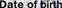

## Script explination

The script consists of 10 methods (functions), 5 main methods, and another 5 extra methods for helping in the middle steps.

-------

### |: helping methods

- `extract_text(self, path)`: this function takes one image path and extracts text from it.
it uses `textract` process with language = 'deu' >> german

- `get_src_images(self)`: this function takes no input, it looks for input images in `res` directory
- `get_temp_images(self,path)`: this function takes a path to look in for temp images.
- `write_threshold(self,img,name,img_name,thresh)`: this function makes the threshold for and input img, and save it in `res/detection` directory with the name of name_image_name (input args), or write the same image with same name prefix
- `clear_field_new(self, var, *field)`: this function takes one string value, and a list of strings to remove from the first input.

-------

### ||: Main methods

- `read_pdf_split_images(self)`: This function takes no inputs, and it searches for the pdf in `pdf_path` that was provided when creating the class and searches for any pdf in this directory (please put only one at a time.)
then it split it into images and rotates them if needed.
(all tests were made with the 5 pdfs in the docs directory)

- `detect_id_and_split(self)`: This function takes no inputs, and it gets src images and validates that there are images that was detected in the pdf, then it loops on each template and looks for a match with a threshold (threshold part will be explained below). after finding a match it detects it and crops the images and saves them for the next step

-`crop_image_and_detect_text(self)`: This function takes no inputs, and it detects the cropped images and loops them to detect text in them, storing them in a variable for the next step.

- `add_data_to_output(self)`: This function takes no inputs, and it is the main cleaning function, it takes the output from the previous function and cleans it by fields, and stores it for the last write output step.
  
- `get_output(self)`: This function takes no inputs, and it writes the JSON file inside `out_path` that was provided when creating the class.

-------

## Files structure 
### directories
- `docs`: this directory stores all test files (not needed in the script, just to show input examples.)
- `res`: this is the result directory, to prevent conflict make sure it is empty before running the script, after running the script, you can find three types of file/directories 
  - `detection`: this directory contains all detected and cropped images.
  - `output.json`: this is the output JSON file from the ID card.
  - `id_0.jpg` and/or `id_1.jpg`: those are the images detected from the pdf. (it can be more or less, depending on the accuracy of the images and model)
  
- `src`: this directory contains the pdf of the id card
- `temp`: this directory contains all template images, we can increase training data by adding more images here (will discuss that below).

### files
- `final_script.py`: this is the full script as one Python file.
- `final_script.ipynb`: this is the colab notebook for the script.
- `requirements.txt`: this file contains all necessary packages to be installed
- `readme.md`: this file contains some documentation info

-------
## How to add training data to increase accuracy

Training data is matching templates, that mean the more templates to match, the more accuracy I can get.

we have 6 fields to match on 
- Fname
- Secname
- serialNum
- birth
- expirty 
- startDate
each of these fields has it's own templates, such as 

 


those two images are only the available templates for `date of birth` taken from two different id cards.
the script is searching for those matches with a certain level of similarity (threshold value). this value is provided in the class definition
see the first line inside `threshold_doc` in `ExtractFromDoc` class.
```
ExtractFromDoc(
            threshold_doc={
                'birth': 0.8,
                'expirty': 0.8,
                'Fname': 0.8,
                'Secname': 0.8,
                'serialNum': 0.8,
                'startDate': 0.8,
                }, 
            threshold=0.8,
            pdf_path='src',
            out_path='res'
            )
```
so these `threshold_doc` values can be called 
"the similarity threshold values".
it detects what is the approximation level in searching for these templates.

also, `threshold`: is the general value, it is only there for any missing defined value, so if  `threshold_doc` was empty the threshold value will be `threshold=0.8` in the above example.

In order to add more `date of birth` templates, you just have to add the same section on an image like the already existing templates and follow the naming convention 
- birth_tem.png
- birth_tem2.png
- birth_tem3.png
- birth_tem4.png

and the same applies to all fields.

-------